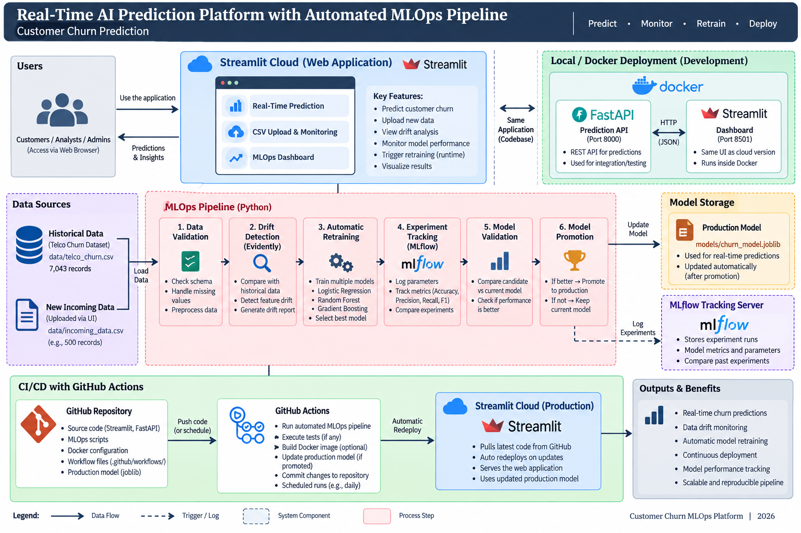

# 🤖 Real-Time Customer Churn Prediction Platform with Automated MLOps

An end-to-end Machine Learning Operations (MLOps) platform for **real-time customer churn prediction, data drift monitoring, automated model retraining, experiment tracking, model validation, CI/CD, and cloud deployment**.

The system demonstrates how a machine learning model can be monitored and updated as new customer data becomes available.

---

## 🌐 Live Application

The Customer Churn AI platform is deployed using **Streamlit Community Cloud**.

**Live Application:**

https://customer-churn-ai-gamage.streamlit.app/

The web application provides:

- Real-time customer churn prediction
- Customer churn probability
- Incoming CSV data upload
- Downloadable sample CSV schema
- Dataset schema validation
- Target label validation
- Incoming data monitoring
- Automated MLOps pipeline execution

---

# 📌 Project Overview

Customer churn prediction helps organizations identify customers who are likely to stop using their services.

Traditional machine learning systems often use a model that is trained once and then deployed without continuously monitoring changes in production data.

This project addresses that limitation by implementing an automated MLOps workflow.

The platform can:

1. Generate real-time churn predictions.
2. Accept newly collected customer data.
3. Validate incoming data.
4. Detect changes in the incoming data distribution.
5. Trigger model retraining when significant drift is detected.
6. Track machine learning experiments using MLflow.
7. Generate a candidate model.
8. Compare the candidate against the current production model.
9. Promote the candidate when its performance is acceptable.
10. Run automated workflows using GitHub Actions.
11. Deploy the web application through Streamlit Cloud.

---

# 🎯 Project Objectives

The main objectives of this project are to:

- Build an end-to-end machine learning pipeline.
- Provide real-time AI predictions.
- Detect data drift in incoming production data.
- Automatically retrain models when required.
- Track machine learning experiments.
- Validate candidate models before production promotion.
- Containerize the application using Docker.
- Implement CI/CD using GitHub Actions.
- Deploy the prediction platform to the cloud.
- Provide an interface for monitoring and managing incoming data.

---

# ✨ Key Features

### 🔮 Real-Time Churn Prediction

Users can enter customer information through the Streamlit interface and receive:

- Churn / Stay prediction
- Churn probability
- Churn risk visualization

The deployed production model is loaded from:

```text
models/churn_model.joblib
```

---

### 📤 Incoming Production Data Upload

The MLOps dashboard allows new labeled customer data to be uploaded as CSV files.

The system displays:

- Number of records
- Number of columns
- Missing values
- Data preview
- Churn distribution

---

### 📄 Downloadable Dataset Template

Users can download a sample CSV directly from the dashboard.

This demonstrates the expected schema and valid example values for incoming production data.

---

### 🔎 Schema Validation

Before incoming data enters the MLOps pipeline, the application verifies that all required features are available.

The system also validates the target column:

```text
Churn = Yes / No
```

Invalid datasets are rejected before entering the retraining workflow.

---

### 📊 Data Drift Monitoring

The platform compares newly received customer data against historical training data.

**Evidently** is used to generate drift analysis and an HTML drift report.

The current automated trigger also evaluates changes in important numerical features such as:

- MonthlyCharges
- tenure

A configured threshold determines whether retraining should be triggered.

---

### 🔄 Automated Model Retraining

When significant drift is detected, the monitoring pipeline automatically starts the retraining process.

The retraining pipeline evaluates multiple machine learning algorithms:

- Logistic Regression
- Random Forest
- Gradient Boosting

The model with the strongest F1 score is selected as the candidate model.

---

### 🧪 MLflow Experiment Tracking

MLflow is used to track machine learning experiments.

Tracked information includes:

- Model type
- Accuracy
- Precision
- Recall
- F1 score
- Historical record count
- Incoming record count
- Total training records
- Model artifacts

This makes model experimentation reproducible and easier to compare.

---

### 🏆 Candidate Model Validation and Promotion

Retraining does not immediately replace the production model.

The system follows a champion-vs-candidate approach:

```text
Current Production Model
          VS
New Candidate Model
          ↓
   Compare F1 Score
          ↓
Candidate acceptable?
     /          \
   No            Yes
   ↓              ↓
Reject          Promote
```

If the candidate satisfies the promotion criterion, it replaces:

```text
models/churn_model.joblib
```

Otherwise, the existing production model remains active.

---

### ⚙️ Automated GitHub Actions Workflow

GitHub Actions automates the MLOps workflow.

The automated retraining workflow can run:

- On a configured schedule
- When incoming data tracked by the repository changes
- Through manual workflow dispatch for testing/demonstration

The workflow performs:

```text
Checkout Repository
        ↓
Set Up Python
        ↓
Install Dependencies
        ↓
Validate Required Files
        ↓
Run Drift Monitoring
        ↓
Retrain if Required
        ↓
Validate Candidate
        ↓
Promote if Appropriate
        ↓
Detect Production Model Change
        ↓
Commit Updated Model
```

---

### 🚀 Continuous Integration and Deployment

A separate CI/CD workflow validates application changes.

The workflow performs operations including:

- Dependency installation
- Python source validation
- Production model loading test
- Docker image build

The Streamlit application is connected to the GitHub repository and redeploys when relevant repository changes are pushed.

---

### 🐳 Docker Support

The project is containerized using Docker.

The local/containerized environment includes:

```text
FastAPI Prediction API
Port: 8000

Streamlit Dashboard
Port: 8501
```

Docker Compose can run the application services together.

---

### ⚡ FastAPI Prediction API

A REST prediction API is implemented using FastAPI.

Available endpoints include:

```text
GET /health
POST /predict
```

The API is available in the local/Docker deployment and can be used for application integration and API testing.

> The public cloud interface currently uses Streamlit and directly loads the serialized production model. The FastAPI service is not presented as a separate public cloud endpoint.

---

# 🏗️ System Architecture

The system combines prediction serving, drift monitoring, automated retraining, experiment tracking, CI/CD, and cloud deployment.

```text
                         Users
                           │
                           ▼
                    Streamlit App
                    /            \
                   /              \
                  ▼                ▼
        Real-Time Prediction   Incoming CSV
                  │                │
                  ▼                ▼
          Production Model    Schema Validation
                                   │
                                   ▼
                            Drift Detection
                              (Evidently)
                                   │
                            Drift Detected?
                              /          \
                            No            Yes
                            │              │
                            ▼              ▼
                       Keep Model     Retraining
                                          │
                    ┌─────────────────────┼────────────────────┐
                    ▼                     ▼                    ▼
             Logistic Regression    Random Forest    Gradient Boosting
                    └─────────────────────┼────────────────────┘
                                          ▼
                                   MLflow Tracking
                                          │
                                          ▼
                                    Best Candidate
                                          │
                                          ▼
                              Candidate vs Production
                                          │
                                          ▼
                                      Promotion
                                          │
                                          ▼
                                  Production Model
                                          │
                                          ▼
                                   GitHub Actions
                                          │
                                          ▼
                                    Cloud Update
```

The project also contains a graphical architecture diagram under the project documentation/evidence assets.



---

# 🧠 Machine Learning Models

Three classification algorithms were initially evaluated.

| Model | Accuracy | Precision | Recall | F1 Score |
|---|---:|---:|---:|---:|
| Logistic Regression | 0.8055 | 0.6572 | 0.5588 | **0.6040** |
| Random Forest | 0.7637 | 0.5485 | 0.6203 | 0.5822 |
| Gradient Boosting | **0.8062** | **0.6735** | 0.5241 | 0.5895 |

Because the pipeline selects the model using **F1 score**, Logistic Regression was selected from this experiment.

F1 score is useful for churn prediction because it balances precision and recall rather than relying only on overall accuracy.

---

# 📊 Dataset

The project uses the **Telco Customer Churn** dataset.

Dataset size:

```text
7,043 customer records
21 original columns
```

The target variable is:

```text
Churn
```

Possible values:

```text
Yes
No
```

`customerID` is removed before model training because it is an identifier rather than a predictive feature.

---

# 🧹 Data Preprocessing

The preprocessing pipeline handles numerical and categorical features.

### Numerical Features

Examples:

```text
SeniorCitizen
tenure
MonthlyCharges
TotalCharges
```

Processing includes:

- Numeric conversion
- Missing-value handling
- Median imputation
- Scaling where required

### Categorical Features

Examples:

```text
gender
Partner
Dependents
InternetService
Contract
PaymentMethod
```

Processing includes:

- Missing-value imputation
- One-hot encoding
- Unknown-category handling

The preprocessing logic is stored inside the trained Scikit-learn pipeline, helping maintain consistency between training and prediction.

---

# 🔁 Automated MLOps Lifecycle

```text
Historical Dataset
        +
Incoming Production Data
        ↓
Data Validation
        ↓
Data Drift Detection
        ↓
Is Significant Drift Detected?
       / \
     No   Yes
     │     │
     │     ▼
     │  Automatic Retraining
     │     │
     │     ▼
     │  MLflow Tracking
     │     │
     │     ▼
     │  Candidate Model
     │     │
     │     ▼
     │  Model Validation
     │     │
     │     ▼
     │  Promotion Decision
     │     │
     └─────┴──────► Production Model
                         │
                         ▼
                      CI/CD
                         │
                         ▼
                  Cloud Application
```

---

# 📁 Project Structure

```text
customer-churn-mlops/
│
├── data/
│   ├── telco_churn.csv
│   └── incoming_data.csv
│
├── src/
│   ├── train.py
│   ├── preprocess.py
│   ├── predict.py
│   └── experiment.py
│
├── models/
│   ├── churn_model.joblib
│   ├── candidate_model.joblib
│   └── candidate_f1.txt
│
├── monitoring/
│   ├── drift.py
│   ├── retrain.py
│   ├── promote.py
│   ├── pipeline.py
│   ├── simulate_incoming.py
│   └── drift_report.html
│
├── dashboard/
│   └── app.py
│
├── tests/
│   └── test_api.py
│
├── .github/
│   └── workflows/
│       ├── ci-cd.yml
│       └── mlops-retrain.yml
│
├── Dockerfile
├── docker-compose.yml
├── requirements.txt
├── .gitignore
└── README.md
```

> Candidate model files are intermediate MLOps artifacts and may be excluded from version control depending on the repository configuration.

---

# 🛠️ Technology Stack

| Category | Technology |
|---|---|
| Programming Language | Python |
| Machine Learning | Scikit-learn |
| Data Processing | Pandas |
| Prediction API | FastAPI |
| API Server | Uvicorn |
| Web Dashboard | Streamlit |
| Experiment Tracking | MLflow |
| Drift Analysis | Evidently |
| Model Serialization | Joblib |
| Containerization | Docker |
| Multi-container Development | Docker Compose |
| Version Control | Git / GitHub |
| CI/CD | GitHub Actions |
| Cloud Web Deployment | Streamlit Community Cloud |

---

# 💻 Local Installation

## 1. Clone the Repository

```bash
git clone <your-repository-url>
cd customer-churn-mlops
```

---

## 2. Create a Virtual Environment

### Windows

```powershell
python -m venv venv
```

Activate:

```powershell
.\venv\Scripts\Activate.ps1
```

If PowerShell blocks activation:

```powershell
Set-ExecutionPolicy -ExecutionPolicy Bypass -Scope Process
```

Then:

```powershell
.\venv\Scripts\Activate.ps1
```

---

## 3. Install Dependencies

```bash
pip install -r requirements.txt
```

---

# 🔮 Run the Streamlit Application

```bash
streamlit run dashboard/app.py
```

The local dashboard will normally be available at:

```text
http://localhost:8501
```

---

# ⚡ Run the FastAPI Service

```bash
uvicorn src.predict:app --reload
```

The API will normally be available at:

```text
http://localhost:8000
```

FastAPI interactive API documentation:

```text
http://localhost:8000/docs
```

---

# 🧪 Run MLflow

Start the MLflow tracking interface:

```bash
mlflow server --port 5000
```

Then access:

```text
http://127.0.0.1:5000
```

The MLflow interface can be used to inspect experiment runs and compare model metrics.

---

# 📊 Run Drift Monitoring

```bash
python monitoring/drift.py
```

The monitoring process compares historical and incoming data and generates the Evidently drift report.

---

# 🔄 Run the Complete MLOps Pipeline

```bash
python monitoring/pipeline.py
```

This acts as the main pipeline entry point.

It can execute:

```text
Drift Detection
      ↓
Automatic Retraining
      ↓
Experiment Tracking
      ↓
Candidate Generation
      ↓
Candidate Validation
      ↓
Model Promotion
```

depending on the detected conditions.

---

# 🐳 Run with Docker

Build the application:

```bash
docker compose build
```

Start the services:

```bash
docker compose up
```

The containerized environment exposes:

```text
FastAPI   → localhost:8000
Streamlit → localhost:8501
```

Stop the containers using:

```bash
docker compose down
```

---

# ⚙️ CI/CD Workflows

The repository contains two main GitHub Actions workflows.

### Customer Churn MLOps CI/CD

Used to validate application changes and verify that the application can be built successfully.

### Automated MLOps Retraining

Used to execute the automated model lifecycle.

The workflow can perform:

```text
Drift Monitoring
      ↓
Retraining
      ↓
Candidate Validation
      ↓
Model Promotion
      ↓
Production Artifact Update
```

A scheduled trigger enables periodic monitoring without requiring a person to manually execute each individual ML pipeline step.

---

# ☁️ Cloud Deployment

The public web application is deployed through Streamlit Community Cloud.

Deployment flow:

```text
GitHub Repository
        ↓
Streamlit Community Cloud
        ↓
Build Application
        ↓
Load Production Model
        ↓
Serve Web Application
```

When deployment-relevant repository changes are available, the Streamlit deployment can rebuild/redeploy the application.

---

# 🧪 Example Prediction

Example high-risk customer:

```json
{
  "gender": "Female",
  "SeniorCitizen": 1,
  "Partner": "No",
  "Dependents": "No",
  "tenure": 2,
  "PhoneService": "Yes",
  "MultipleLines": "Yes",
  "InternetService": "Fiber optic",
  "OnlineSecurity": "No",
  "OnlineBackup": "No",
  "DeviceProtection": "No",
  "TechSupport": "No",
  "StreamingTV": "Yes",
  "StreamingMovies": "Yes",
  "Contract": "Month-to-month",
  "PaperlessBilling": "Yes",
  "PaymentMethod": "Electronic check",
  "MonthlyCharges": 95.0,
  "TotalCharges": 190.0
}
```

The platform returns a churn classification together with a probability score.

---

# 🔐 Model Safety and Validation

The platform includes several safeguards before updating the production model:

- Incoming schema validation
- Target label validation
- Drift threshold checking
- Candidate model generation
- Current-vs-candidate performance comparison
- Conditional model promotion
- Version-controlled production artifact
- Automated CI validation

This reduces the risk of blindly replacing a working production model with a weaker candidate.

---

# 📈 Future Improvements

Potential future improvements include:

- Persistent cloud object storage for uploaded production datasets
- Managed MLflow tracking server
- Model registry
- Dedicated cloud-hosted FastAPI inference service
- Authentication and role-based access control
- Database-backed prediction logging
- Advanced feature-level drift thresholds
- Model performance drift monitoring
- Automated rollback
- Notifications when retraining occurs
- Kubernetes deployment
- Managed model serving infrastructure

---

# ⚠️ Current Deployment Scope

This project is an educational end-to-end MLOps implementation.

The public Streamlit deployment demonstrates real-time inference, incoming-data validation, and MLOps controls.

The local/Docker environment additionally provides the FastAPI prediction service.

GitHub Actions provides automated CI and scheduled/version-controlled MLOps execution.

For a large-scale production environment, uploaded datasets, experiment metadata, and model artifacts would normally be stored in persistent cloud services rather than relying on an application instance's local filesystem.

---

# ✅ Project Deliverables

| Requirement | Implementation |
|---|---|
| Complete GitHub Repository | ✅ |
| End-to-End ML Pipeline | ✅ |
| Real-Time Predictions | ✅ |
| Automated Retraining | ✅ |
| Experiment Tracking | ✅ MLflow |
| Data Drift Monitoring | ✅ Evidently + automated threshold |
| Candidate Model Validation | ✅ |
| Model Promotion | ✅ |
| Dockerized Application | ✅ |
| FastAPI Prediction API | ✅ Local/Docker |
| CI/CD Workflow | ✅ GitHub Actions |
| Scheduled MLOps Workflow | ✅ GitHub Actions |
| Monitoring Dashboard | ✅ Streamlit |
| Cloud Deployment | ✅ Streamlit Community Cloud |
| Architecture Diagram | ✅ |
| Technical Documentation | ✅ |

---

# 🏁 Conclusion

This project demonstrates an end-to-end MLOps architecture for customer churn prediction.

Instead of treating machine learning as a one-time training process, the platform integrates:

**prediction → monitoring → drift detection → retraining → experiment tracking → validation → promotion → CI/CD → deployment.**

The result is a reproducible machine learning workflow capable of adapting to newly collected data while maintaining validation controls around production model updates.